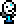
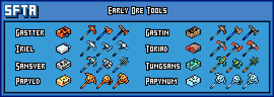
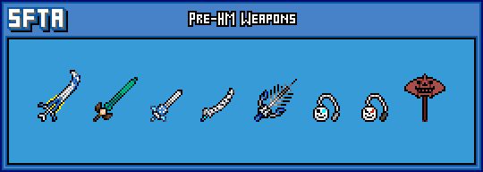
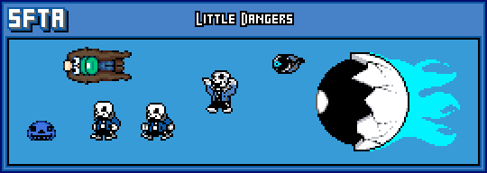
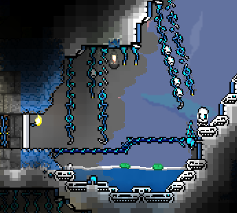
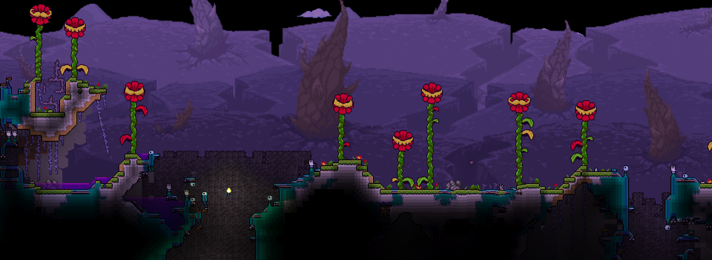

# 

Sans Fanfic: Terraria Adventure (SFTA) is a [_Terraria_] [Resource Pack] that
aims to change _**every single**_ asset in the game
to be themed around [_Sans Fanfic_].

That mainly includes the game's **13,594** images and,
to a lesser extent, over **27,000** text entries.

> 
> You can find out more info on the [Forum Page].

##  Image Demos

##  Releases

> 
> Get the pack on the [Steam Workshop Page]!

- A new **major** release is made every thousand or so sprites.
- **Minor** releases mostly consist of minor edits and non-image assets.

In total, there will be at least 13 major releases,
judging by the total image count.

##  Status

<!--@template FileCount
Last updated: _{@p time @} UTC_

- **{@p img @}** Images (**{@p img-p @}%** of the way to the next update)
- **{@p loc @}** Text Entries
- **{@p mus @}** Songs
- **{@p snd @}** Sounds
@end-template-->
<!--@region FileCount-->
Last updated: _2023-08-10 UTC_

- **1068** Images (**6%** of the way to the next update)
- **3047** Text Entries
- **17** Songs
- **22** Sounds
<!--@end-region-->

##  QnA

### "When will next update be out?"

thats a good question megaman

### "Where is the player model?"

While the actual `Player_*` sprites are complete,
most of the hair, armor, accessories, etc. are not.

Due to this, the visuals really clash.
So the player model will only be brought to the main branch
when most of its sprites are done.

---

If you have any more questions, send me an ask...

- [here](sans-fanfic.tumblr.com/ask) for questions related to _Sans Fanfic_.
- [here](tey-dev.tumblr.com/ask) for questions related to development.

---

This is a fan project.

The original images are licensed under a [Creative Commons Attribution-NonCommercial-ShareAlike 4.0 International License]

The code in this project is under the [MIT License]

The rights to Undertale, Deltarune, Mario and Portal
belong to their respective owners.

<!-- References -->

[_Terraria_]: https://terraria.org/
[Resource Pack]: https://terraria.wiki.gg/wiki/Resource_Pack
[_Sans Fanfic_]: sans-fanfic.tumblr.com
[Forum Page]: https://forums.terraria.org/index.php?threads/sans-fanfic-terraria-adventure.113654/#post-275484
[Steam Workshop Page]: https://steamcommunity.com/sharedfiles/filedetails/?id=3006001590
[MIT License]: https://github.com/ThEnderYoshi/sf-terraria-adventure/blob/main/LICENSE
[Creative Commons Attribution-NonCommercial-ShareAlike 4.0 International License]: http://creativecommons.org/licenses/by-nc-sa/4.0/
