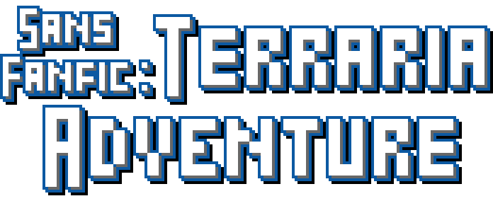
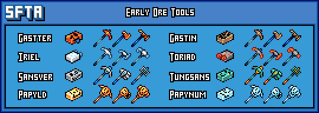
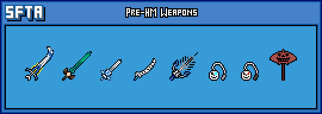
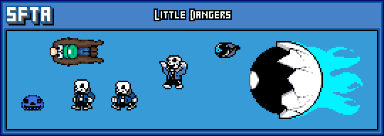
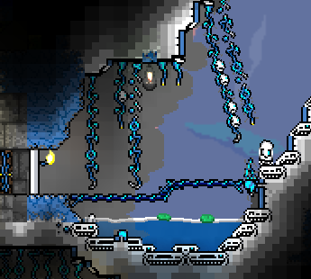
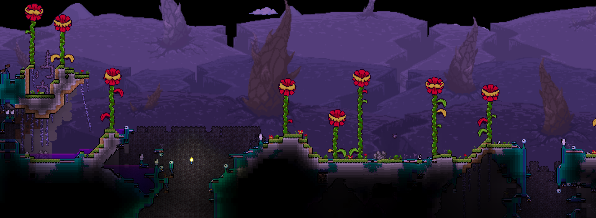

<!--
  NOTE: The text between the `#region` and `#endregion` comments are
  auto-generated by `update_readme.py`. Don't touch them!
-->

# 

Sans Fanfic: Terraria Adventure (SFTA) is a
[_Terraria_] [Resource Pack] that aims to change _**every single**_ asset in the
game to be themed around [_Sans Fanfic_].

That mainly includes the game's
**<!--#region img_count-->14,994<!--#endregion-->** images and
**<!--#region txt_count-->19,963<!--#endregion-->** text entries. See the
`Status` section below for the current progress.

> [!NOTE]
>  You can find out more info on
> the [Forum Page].

## 

## 

> [!NOTE]
>  Get the pack on the [Steam Workshop Page]!

([Changelog](CHANGELOG.md))

- A new **major** release is made every thousand or so sprites.
- **Minor** releases mostly consist of minor edits and non-image assets.

In total, there will be at least 13 major releases, judging by the total image
count. At the rate things are going, this project will take _over a decade_ to
complete, so **strap in!!!**

## 

<!--#region progress-->
> [!NOTE]
> Last updated: _2026-02-10 UTC_

| Progress     |                                      |
|:------------:|:------------------------------------:|
| Total        |  |
| Update       |  |
| Images       | 1,952 / 14,994                       |
| Text Entries | 4,337 / 19,963                       |
| Songs        | 24 / 104                             |
| Sounds       | 68 / 851                             |
<!--#endregion-->

## 

### "When will next update be out?"

thats a good question megaman

### "Where is the player model?"

While the actual `Player_*` sprites are complete, most of the hair, armor,
accessories, etc. are not. This means the visuals really clash, so the player
model will only be brought to the main pack when most of its sprites are done.

Currently, the player model as well as the equipped GFX for added
armors/accessories are in a separate Resource Pack, but I'm not sure it'll be
made public.

---

If you have any more questions, send me an ask...

- [here for questions related to
  _Sans Fanfic_](sans-fanfic.tumblr.com/ask).
- [here for questions related to development](tey-dev.tumblr.com/ask).

---

This is a fan project.

[![Creative Commons License][cc image]][cc by-nc-sa 4.0]

The images original to this project are licensed under a
[Creative Commons Attribution-NonCommercial-ShareAlike 4.0 International
License][cc by-nc-sa 4.0]

The code in this project is under the [MIT License]

The rights to Undertale, Deltarune, Mario, Portal and Submachine
belong to their respective owners.
None of these owners endorse or are associated with this project.

<!-- References -->

[_Terraria_]: https://terraria.org/
[Resource Pack]: https://terraria.wiki.gg/wiki/Resource_Pack
[_Sans Fanfic_]: sans-fanfic.tumblr.com
[Forum Page]: https://forums.terraria.org/index.php?threads/sans-fanfic-terraria-adventure.113654/#post-275484
[Steam Workshop Page]: https://steamcommunity.com/sharedfiles/filedetails/?id=3006001590
[MIT License]: https://github.com/ThEnderYoshi/sf-terraria-adventure/blob/main/LICENSE
[cc by-nc-sa 4.0]: http://creativecommons.org/licenses/by-nc-sa/4.0/
[cc image]: https://i.creativecommons.org/l/by-nc-sa/4.0/88x31.png
